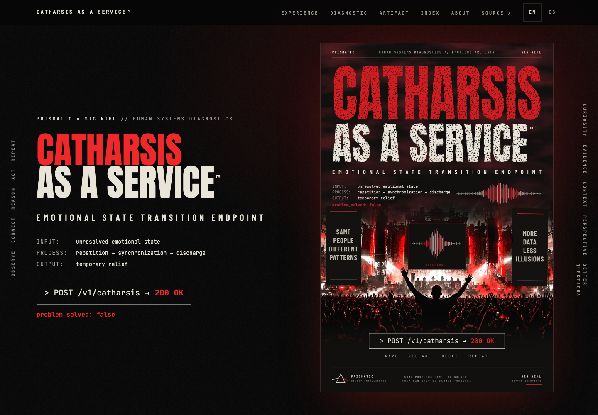

# CATHARSIS AS A SERVICE™

> Emotional State Transition Endpoint

[](https://github.com/korczis/catharsis-as-a-service/actions/workflows/pages.yml)

**Live:** https://korczis.github.io/catharsis-as-a-service/ ([čeština](https://korczis.github.io/catharsis-as-a-service/cs/)) ·
**Releases:** https://github.com/korczis/catharsis-as-a-service/releases ·
**Commands:** https://korczis.github.io/catharsis-as-a-service/commands/ ·
**API:** https://korczis.github.io/catharsis-as-a-service/api/v1/index.json



```text
INPUT    unresolved emotional state
PROCESS  repetition → synchronization → discharge
OUTPUT   temporary relief

problem_solved: false
```

## Intent

An artwork and an evidence library about one confusion: the belief that feeling released means that
something has been resolved. The poster presents collective euphoria; the site examines it, explains what
psychology and neuroscience can and cannot say about catharsis, and turns the evidence into graded advice.

The site is educational. It is not a diagnostic or treatment tool, and no metric on it measures anyone.

## What is inside

| Area | Content | Source of truth |
|---|---|---|
| Landing | intent, definition of catharsis, the relief loop, evidence highlights, FAQ, how it was made | `content/_index.md`, `content/_index.cs.md` |
| Research | research notes with key points, figures and references | `content/research/` |
| Advice | entries graded by strength of evidence, with practice steps and limits | `content/advice/` |
| Theory | essays: catharsis theories, process model, appraisal, basic vs constructed emotion, social sharing, avoidance learning, allostasis, collective ritual | `content/theory/` |
| Interactive models | relief loop, venting and arousal, peak–end memory, Kuramoto synchrony, allostatic load | `content/models/`, `static/js/models.js` |
| Search | diacritic-insensitive search over pages and glossary terms in both languages | `api/v1/search.<lang>.json` |
| Methods | detection model, temporal model, detection matrix, uncertainty vocabulary, architecture status, a labelled simulation | `content/methods/` |
| Evidence ledger | every public claim graded by level and confidence, with sources and review dates | `data/claims.toml`, `data/sources.toml` |
| Glossary | psychological, physiological and methodological terms (`/glossary/`, `/cs/slovnik/`) | `data/glossary.toml` |
| Status | build revision, content version, ledger statistics, next reviews | generated at build time |
| References | every citation, with Crossref-verified DOIs | `data/references.toml` |
| Commands | every documented command, its source and the test that runs it | `data/commands.toml` |
| API | versioned JSON export for other applications | `api/v1/` (generated) |
| Tags | topic taxonomy in both languages | front matter `[taxonomies]` |

## How it was made

Built in one working session by an AI coding agent directed by one person and supervised by
[Majordomus](https://majordomus.dev). Recorded timeline of the first release (UTC, 14 September 2026):
repository created 09:54:06, Majordomus initialised 10:26:23, release v0.1.0 verified and published 10:45:42.
That is 51 min 36 s from an empty repository and 19 min 19 s from supervision start. The research note
"Method" on the site documents the kinds of instructions, what Majordomus caught and what cannot be claimed.

## Architecture

| Concern | Lives in |
|---|---|
| Content and landing blocks | Markdown front matter, one file per locale |
| UI strings | `zola.toml` translations, read with `trans()` |
| Presentation | Tera v2 components in `templates/components/`, Tailwind CSS 4 in `styles/app.css` |
| Interaction | Alpine.js (header, view switch, copy), Flowbite (modal, drawer, tooltip, accordion) |
| Metadata | `templates/partials/head.html` (Open Graph, Twitter, hreflang) and `structured-data.html` (JSON-LD) |
| Validation | Python validators, Playwright, pytest, Rust contract tests |
| Delivery | `.github/workflows/ci.yml` and `pages.yml` |
| Supervision | `.ai/` (Majordomus policy, rules, workflows); `.githooks/` |

Flowbite provides mechanics only; markup follows the official component documentation and appearance comes from
the project's design tokens.

## Local development

Requirements: Node.js 22+, Python 3.11+, Zola 0.23.6, Rust 1.98.1 (via `rust-toolchain.toml`) and Majordomus.

```sh
npm ci
python3 -m venv .venv && .venv/bin/pip install -r requirements-dev.txt
npm run dev
npm run preview
```

Setup: [`npm ci`](https://korczis.github.io/catharsis-as-a-service/commands/#npm-ci) and
[`python3 -m venv .venv`](https://korczis.github.io/catharsis-as-a-service/commands/#python-venv).
Authoring: [`npm run dev`](https://korczis.github.io/catharsis-as-a-service/commands/#npm-run-dev) serves the site with live
reload; [`npm run preview`](https://korczis.github.io/catharsis-as-a-service/commands/#npm-run-preview) serves a production
build under the same subpath as GitHub Pages.

## Quality gates

```sh
npm run validate
npm run test:python
npm test
cargo fmt --all --check
cargo clippy --workspace --all-targets -- -D warnings
cargo test --workspace
python3 scripts/check-references.py --online
python3 scripts/validate-claims.py
```

- [`npm run validate`](https://korczis.github.io/catharsis-as-a-service/commands/#npm-run-validate): toolchain, assets,
  JavaScript syntax, translation parity, content standards and command links, references, Zola check and build, API export,
  HTML, JSON-LD, preview metadata, links, anchors and sitemap.
- [`npm run test:python`](https://korczis.github.io/catharsis-as-a-service/commands/#npm-run-test-python): validators, exporter
  and command registry, including a real run of each registered command.
- [`npm test`](https://korczis.github.io/catharsis-as-a-service/commands/#npm-test): Playwright across viewports and both
  languages (layout, previews, JSON-LD, feeds, accordion, modal, drawer, locale negotiation, print, API).
- Rust: [`cargo fmt`](https://korczis.github.io/catharsis-as-a-service/commands/#cargo-fmt),
  [`cargo clippy`](https://korczis.github.io/catharsis-as-a-service/commands/#cargo-clippy) and
  [`cargo test`](https://korczis.github.io/catharsis-as-a-service/commands/#cargo-test).
- [`python3 scripts/check-references.py --online`](https://korczis.github.io/catharsis-as-a-service/commands/#check-references):
  every DOI, title and year against Crossref.
- [`python3 scripts/render-social.py`](https://korczis.github.io/catharsis-as-a-service/commands/#render-social):
  renders a social preview for every page; validation runs it with `--check` so no page ships without its own image.
- [`python3 scripts/validate-claims.py`](https://korczis.github.io/catharsis-as-a-service/commands/#validate-claims):
  the evidence ledger (levels, confidence, review intervals, staleness, coverage) and the glossary. A weekly
  workflow repeats it with Crossref and opens an `evidence-update` issue when anything has expired.

## Deployment and releases

Every push to `main` runs CI (commits, supervision, validation, Python, Rust, references, end-to-end), deploys the
validated build, verifies production with
[`npm run smoke`](https://korczis.github.io/catharsis-as-a-service/commands/#npm-run-smoke) and
[`npm run test:production`](https://korczis.github.io/catharsis-as-a-service/commands/#npm-run-test-production), and then cuts a
release whose version is derived from Conventional Commits
([`scripts/release.sh --dry-run`](https://korczis.github.io/catharsis-as-a-service/commands/#release-dry-run) previews it).
Check recent runs with [`gh run list`](https://korczis.github.io/catharsis-as-a-service/commands/#gh-run-list).

## Supervision

This repository is supervised by Majordomus; agents start at [`AGENTS.md`](AGENTS.md). The pre-commit hook runs
[`majordomus doctor`](https://korczis.github.io/catharsis-as-a-service/commands/#majordomus-doctor) and the pre-push hook runs
[`majordomus finish --check`](https://korczis.github.io/catharsis-as-a-service/commands/#majordomus-finish). Project rules live in
`.ai/repo/rules/project/`.

## Rust integration

The content API under `api/v1` is produced by
[`python3 scripts/export-api.py`](https://korczis.github.io/catharsis-as-a-service/commands/#export-api) and consumed by the
`caas-content` crate; `caas` is a command-line client
([`cargo run -p caas-cli`](https://korczis.github.io/catharsis-as-a-service/commands/#caas-cli)). See
[docs/RUST-INTEGRATION.md](docs/RUST-INTEGRATION.md).

## Documentation

- [docs/ARCHITECTURE.md](docs/ARCHITECTURE.md): layers, routes and validation stages
- [docs/EVIDENCE.md](docs/EVIDENCE.md): the evidence ledger, grading and review workflow
- [docs/CONTENT-STANDARDS.md](docs/CONTENT-STANDARDS.md): register, uncertainty vocabulary, prohibited phrasing, medical policy
- [docs/SEO.md](docs/SEO.md): metadata, previews and structured data
- [docs/RUST-INTEGRATION.md](docs/RUST-INTEGRATION.md): the content API, the crate and the CLI

## Adding content

1. Create `content/<research|advice>/<slug>/index.md` and `index.cs.md` with the same front-matter structure.
2. Cite registry ids from `data/references.toml`; add new references with verified DOIs and an appraisal in `data/sources.toml`.
3. Record every substantive claim in `data/claims.toml` (see [docs/EVIDENCE.md](docs/EVIDENCE.md)).
4. Link every command you mention to its entry on the commands page.
5. Run [`npm run validate && npm test`](https://korczis.github.io/catharsis-as-a-service/commands/#npm-run-validate), commit
   (`feat(content): …`) and push.

## License status

© 2026 Sig Nihl. All rights reserved. Fonts are under the SIL Open Font License 1.1 (`static/fonts/LICENSES/`); Alpine.js,
Flowbite and Tailwind CSS are MIT-licensed.
